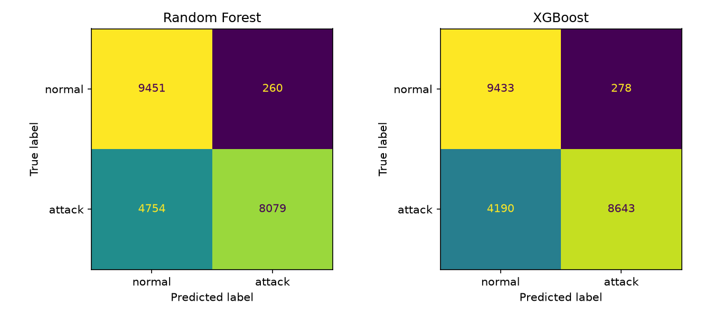
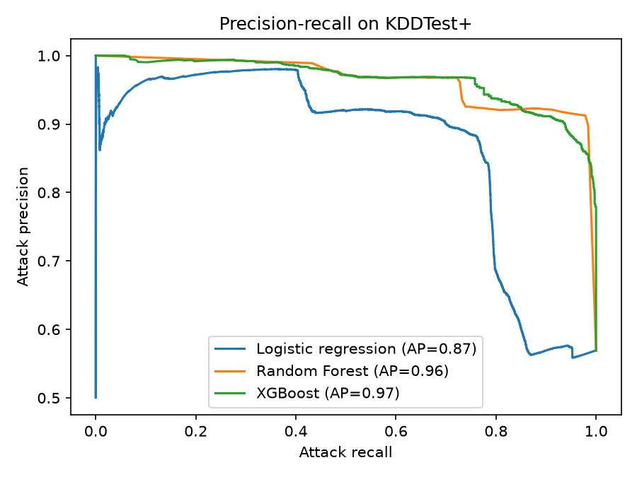
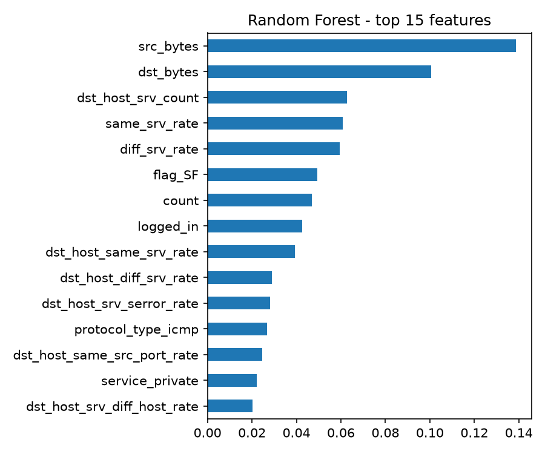

# Network Intrusion Detection (NSL-KDD)

Binary intrusion detection (normal vs attack) on the NSL-KDD benchmark, comparing a majority baseline, logistic regression, Random Forest and XGBoost. The focus is honest evaluation: what the models catch, and what they miss.

## Key finding

All models are precise (about 0.97 attack precision for the tree models) but miss a large share of attacks. The gap comes mainly from **attack types that never appear in training**: on KDDTest+, Random Forest catches 77% of attacks it has seen before but only 29% of unseen ones (XGBoost: 77% vs 43%). Overall attack recall of 0.62-0.67 is a direct result of that.

## Data and evaluation

| | Train (KDDTrain+) | Test (KDDTest+) |
|---|---|---|
| Rows | 125,973 | 22,544 |
| Normal | 53.5% | 43.1% |
| Attack | 46.5% | 56.9% |
| Attack types | 22 | 37 |

- **Binary task.** The original labels have 22 attack types in train, and some are extremely rare (`spy` has 2 examples), so multi-class classification would be unreliable. Every attack type is grouped into one "attack" class (the positive class).
- **Unseen attack types.** 17 attack types appear only in the test file: 3,750 rows, which is 16.6% of the test set and 29.2% of all test attacks. KDDTest+ therefore measures generalization to novel attacks, not just performance on known ones. (The split is predefined by the benchmark; it is not time-ordered.)
- **Preprocessing.** The `difficulty` column is dropped (it is not a network feature). `protocol_type`, `service` and `flag` are one-hot encoded with the encoder fit on the training data only; unknown categories in test would be ignored (none occurred). Numeric features are unscaled for the tree models and standardized for logistic regression.
- **No tuning.** All models use default hyperparameters, so KDDTest+ was used only for the final evaluation. No train/test duplicates within either file.
- **Metrics.** Attack precision, recall and F1, macro F1 and PR-AUC, with accuracy as a secondary number. A missed attack (false negative) is the costlier error, so attack recall is the headline metric, balanced against precision so analysts are not flooded with false alarms.

## Results on KDDTest+

Random Forest and XGBoost: mean ± std over 5 seeds. XGBoost with default settings is deterministic, so its std is 0.

| Model | Accuracy | Attack precision | Attack recall | Attack F1 | Macro F1 | PR-AUC |
|---|---|---|---|---|---|---|
| Majority baseline | 0.431 | 0.000 | 0.000 | 0.000 | 0.301 | 0.569 |
| Logistic regression | 0.754 | 0.918 | 0.625 | 0.743 | 0.754 | 0.866 |
| Random Forest | 0.772 ± 0.007 | 0.968 ± 0.001 | 0.619 ± 0.013 | 0.755 ± 0.010 | 0.771 ± 0.008 | 0.961 ± 0.002 |
| XGBoost | 0.802 ± 0.000 | 0.969 ± 0.000 | 0.673 ± 0.000 | 0.795 ± 0.000 | 0.802 ± 0.000 | 0.965 ± 0.000 |

**Attack recall by whether the attack type was seen in training**

| Model | Seen attack types | Unseen attack types |
|---|---|---|
| Random Forest | 0.768 | 0.293 |
| XGBoost | 0.772 | 0.434 |





Observations:
- XGBoost is the best model on every metric, mostly through better recall on unseen attacks.
- Logistic regression is close on accuracy and recall; the tree models' main advantage is precision and PR-AUC.
- The confusion matrices (first seed) show the same pattern: Random Forest raises 260 false alarms on 9,711 normal connections (2.7%) but misses 4,754 of 12,833 attacks; XGBoost raises 278 false alarms (2.9%) and misses 4,190.
- Both tree models stay near 0.97 precision up to roughly 0.7 recall on the precision-recall curves, so the default decision threshold leaves recall on the table.
- The Random Forest relies most on `src_bytes` and `dst_bytes`, followed by traffic-pattern features such as `dst_host_srv_count`, `same_srv_rate`, `diff_srv_rate` and `count`, and the connection flag `flag_SF`. Impurity-based importance favors continuous features with many distinct values, so treat the ranking as indicative; permutation importance would be a more reliable check.

## Limitations

- NSL-KDD is derived from 1999-era traffic, so absolute numbers say little about modern networks. The value is in the comparison and the evaluation method.
- Binary labels hide per-category weakness (for example rare R2L and U2R attacks).
- No hyperparameter tuning or threshold tuning was done. Precision is high and recall is low, so lowering the decision threshold is the obvious next experiment. The threshold should be chosen on a validation split taken from the training data, not on KDDTest+.
- 610 test rows also appear in the training data (about 2.7% of test).

## Why this matters

In a security setting, a missed attack costs far more than a false alarm, so accuracy alone is misleading. The same trade-off applies to anomaly detection in a carrier network or an operations center: models need to flag novel behavior without overwhelming analysts, and this project shows where standard classifiers fall short.

## Synthetic data (pipeline sanity check)

`generate_data.py`, `train_model.py`, `visualise.py` and `compare_models.py` run the same pipeline on a small simulated dataset (1,000 normal + 200 attack connections, stratified 80/20 split). It confirms the pipeline works end to end (Random Forest: accuracy 0.95, attack recall 0.75, AP 0.95). Because the data is generated, these numbers and its feature importances reflect how the simulator was written and are not evidence about real traffic.

## How to run

```
pip install numpy pandas scikit-learn xgboost matplotlib
```

NSL-KDD (place `KDDTrain+.txt` and `KDDTest+.txt` in the project folder):
```
python nsl_kdd_evaluation.py
```
Outputs are written to `results/`.

Synthetic data:
```
python generate_data.py
python train_model.py
python visualise.py
python compare_models.py
```